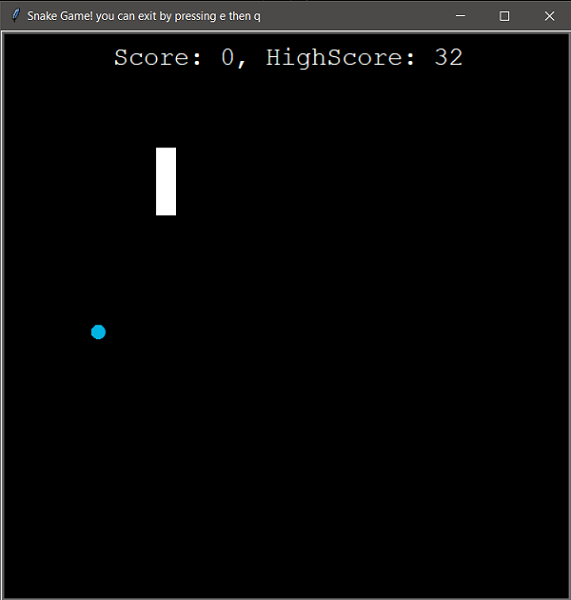
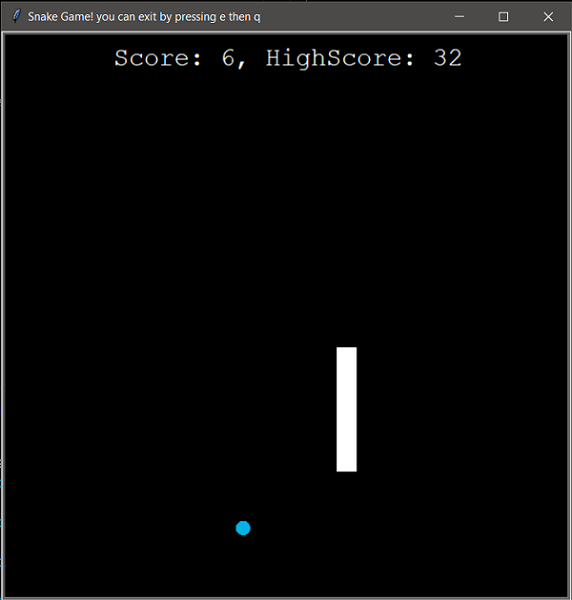

# 🐍 Snake Game
Python is a family of nonvenomous snakes, this is one of them 😂

# What is the game ?
This is your classic arcade game in which a snake is always moving tying to eat some food.

Every time the snake eats (touches) a piece of food it grows.

With this growth comes a challenge for you: **To control this snake and to prevent it from touching the edge of the screen or touching his own tail.**
*While trying to beat my highscore : ) and grow as much as possible*

## Screenshots
 

## How to instal and run
* Make sure you have installed Python from [Python.org](https://www.python.org/)
* Just download and run the python script on your PC
* Run using : `python snake_game.py`

## How to Play ? 🎮
* The snake is always moving, you can only direct it
* Using the Up, Down, Left, Right arrow keys 🔽 🔼 ◀ ▶
* Press e to stop the game and save your highscore 🏁
* the you click the window or can press q, or you can simply click ❌ on the top right
* **Then press q to exit** (sorry if it seems strange 😅)

## Used modules
* **Turtle** : for handling the GUI screen
* **Random** : for placing the food randomly on the screen
* **Time** : for delays and speed control

## Why this was built ?
To learn by using a technique called project based learning. 
I believe in learning by doing. Python is no exception.

## Confessions
* This was not what I really wanted to build as the final project for CS50 
I built a simple script that lets me download video/ audio from a youtube link. 
But I felt that it was too short/small to be considered as a final project 
Also I felt that it was a little bit illegal
* I did not build this from scratch, a lot of it was inspired by a former experience from a course called 100 days of code on Udemy by Dr.Angela Yu

## License

MIT License

Copyright (c) 2023 George Magdy

Permission is hereby granted, free of charge, to any person obtaining a copy
of this software and associated documentation files (the "Software"), to deal
in the Software without restriction, including without limitation the rights
to use, copy, modify, merge, publish, distribute, sublicense, and/or sell
copies of the Software, and to permit persons to whom the Software is
furnished to do so, subject to the following conditions:

The above copyright notice and this permission notice shall be included in all
copies or substantial portions of the Software.

THE SOFTWARE IS PROVIDED "AS IS", WITHOUT WARRANTY OF ANY KIND, EXPRESS OR
IMPLIED, INCLUDING BUT NOT LIMITED TO THE WARRANTIES OF MERCHANTABILITY,
FITNESS FOR A PARTICULAR PURPOSE AND NONINFRINGEMENT. IN NO EVENT SHALL THE
AUTHORS OR COPYRIGHT HOLDERS BE LIABLE FOR ANY CLAIM, DAMAGES OR OTHER
LIABILITY, WHETHER IN AN ACTION OF CONTRACT, TORT OR OTHERWISE, ARISING FROM,
OUT OF OR IN CONNECTION WITH THE SOFTWARE OR THE USE OR OTHER DEALINGS IN THE
SOFTWARE.